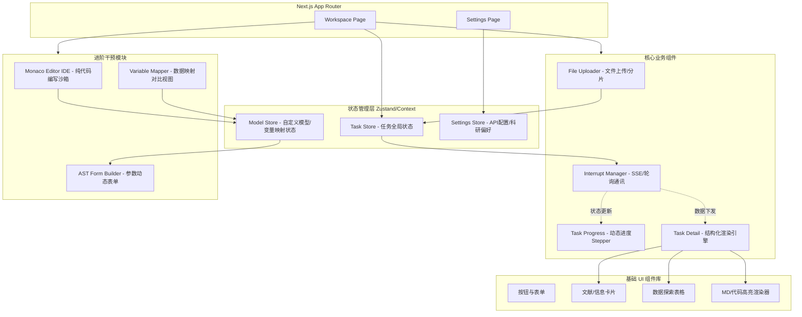

我使用 Mermaid 语法绘制了前端架构图，以便于开发团队直观理解组件层级与数据流向。

***

# 智能科研工作助手：前端 UI 架构与设计规范文档

**负责人：** Mengq
**版本：** v2.0 (重构版)
**核心栈：** Next.js (App Router) + React + CSS Modules / Tailwind + Zustand (状态管理)

---

## 1. 视觉与 UI 设计系统规范 (Design System)

为保证科研工具的专业性与沉浸感，全站严格遵循以下 UI 规范：

### 1.1 色彩规范 (Color Palette)
采用 **Navy (海军蓝)** 体系，降低长时阅读的视觉疲劳，通过明暗对比突出核心数据。
* **Primary (主色)：** `#0F172A` (深邃海蓝，用于全局背景、侧边栏)
* **Surface (层级面板)：** `#1E293B` (卡片背景、输入框底色)
* **Accent (强调色)：** `#38BDF8` (天空蓝，用于按钮、进行中进度条、关键链接)
* **Semantic (语义色)：**
  * `Success`: `#10B981` (完成打勾、成功提示)
  * `Warning`: `#F59E0B` (中断挂起、参数修改提示)
  * `Error`: `#EF4444` (沙箱报错、节点失败)

### 1.2 字体规范 (Typography)
实行“数据与阅读分离”的双字体策略：
* **界面交互与数据表 (UI & Data)：** `Atkinson Hyperlegible`。高辨识度无衬线体，确保变量名（如 $l$ 和 $1$、$O$ 和 $0$）在密集数据表格中清晰无误。
* **文献卡片与研究简报 (Reading & Briefs)：** `Crimson Pro`。专业学术衬线体，还原顶级期刊的阅读质感。

### 1.3 交互动效 (Micro-interactions)
* **原则：** 克制、平滑、具有指向性。
* **规范：** 所有的 Hover 状态过渡时间统一为 `200ms ease-in-out`；禁止大面积的闪烁动效；全面支持 `prefers-reduced-motion` 媒体查询兜底。

---

## 2. 前端架构图 (Frontend Architecture)

采用模块化与组件化的架构设计，分离全局状态、业务逻辑与 UI 渲染。

---

## 3. 核心功能实现矩阵

以下功能模块需严格按照 UI 规范进行组件化开发：

### 3.1 基础工作流与状态感知 (Phase 1 & 2)
| 模块名称 | UI 组件 | 核心功能与交互要求 |
| :--- | :--- | :--- |
| **文件上传引擎** | `FileUploader` | 支持拖拽与点击选择；拖拽区域悬浮时边框高亮呼吸；上传时展示百分比进度；完成后回显文件路径与体积。 |
| **动态进度条** | `TaskProgress` | 横向/纵向 Stepper 布局；节点包含 Pending, Running (动画), Done, Error, Interrupted 五种状态视觉；精准指示当前执行节点。 |
| **详情结构化引擎** | `TaskDetail` | 抛弃原始 JSON。根据 `task.result` 类型分发：数据表展现为可分页 Table；文献呈现为学术卡片集；代码展示自带语法高亮；简报展示为排版良好的 Markdown。 |

### 3.2 进阶定置与人机协同 (Phase 3 & Phase 4)
| 模块名称 | UI 组件 | 核心功能与交互要求 |
| :--- | :--- | :--- |
| **实时通讯管理器** | `InterruptManager` | 实现后台轮询或 SSE 监听；在状态变更时触发界面骨架屏到真实数据的平滑过渡；提供统一的 Error Boundary 兜底。 |
| **自定义代码沙箱** | `CodeIDE` | 集成 Monaco Editor；支持 Python/R 语法高亮；允许用户直接编写核心分析逻辑；提供全屏/分屏双视图模式。 |
| **变量映射与对比视图** | `VariableMapper` | **测试场景基准**：以构建“浙江省碳排放、粮食安全与经济发展（C-F-E）耦合协调度模型”并迁移至新数据集为例。UI 需提供双栏视图，左侧为预设模型所需的各维度评价指标，右侧为新上传数据的表头，支持下拉选择或拖拽进行精准对齐干预。 |
| **动态参数表单** | `ASTFormBuilder` | 根据后端 AST 解析返回的 Schema，侧边栏自动弹出超参数配置面板（如：面板数据滞后期数、显著性阈值设定等）。 |

### 3.3 安全设置与偏好 (Settings)
| 模块名称 | UI 组件 | 核心功能与交互要求 |
| :--- | :--- | :--- |
| **安全凭证管理** | `APIKeyManager` | 密钥输入框默认掩码 (`type="password"`)，带显示/隐藏切换；已配置项仅展示状态（如 `已连接`），不回显真实密钥字符串。 |
| **科研偏好面板** | `PreferenceForm` | 下拉框选择默认计量模型（OLS / Panel FE / DID 等）；全局编码与文献数量预设。 |

---

## 4. UI 验收与测试标准
1. **响应式与布局：** 核心工作台需支持宽屏（1440px+）与常规笔记本屏幕（1080p），侧边栏支持折叠，保证核心分析视图的显示面积。
2. **状态可视化测试：** 模拟网络断开、沙箱执行超时、AST 解析失败等极端情况，确保前端 UI 能够正确捕获并呈现对应的 Warning/Error 状态，且提供“重试/修改参数”的交互入口。
3. **无障碍设计 (a11y)：** 表单元素必须有明确的 `aria-label`；所有色彩搭配的对比度需满足 WCAG AA 级标准。