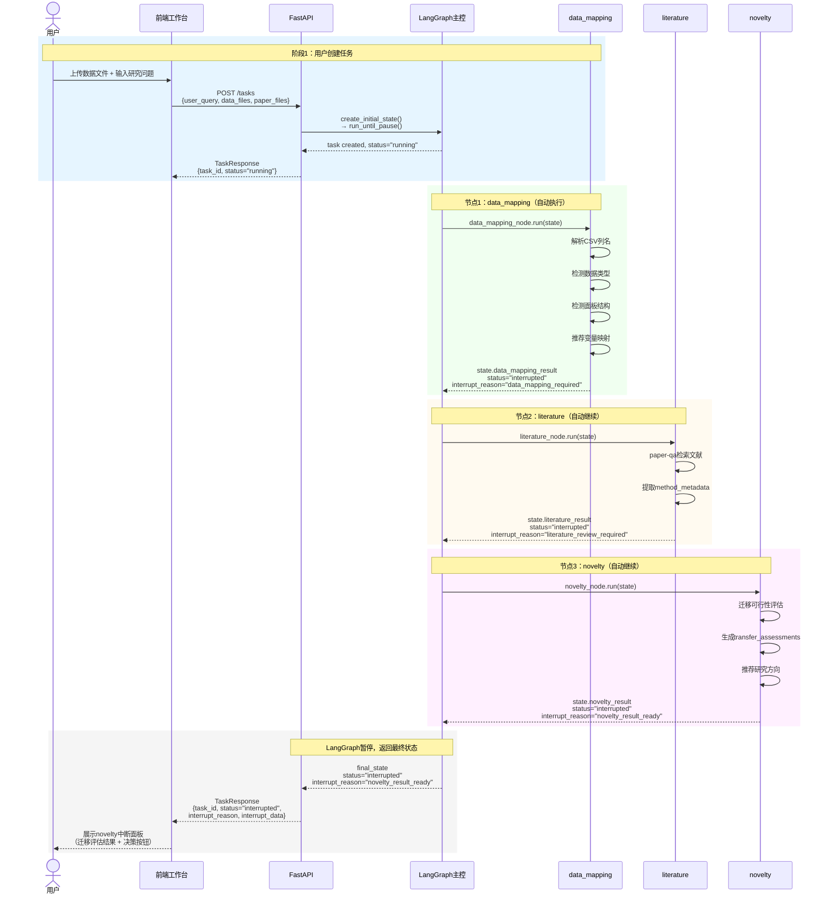
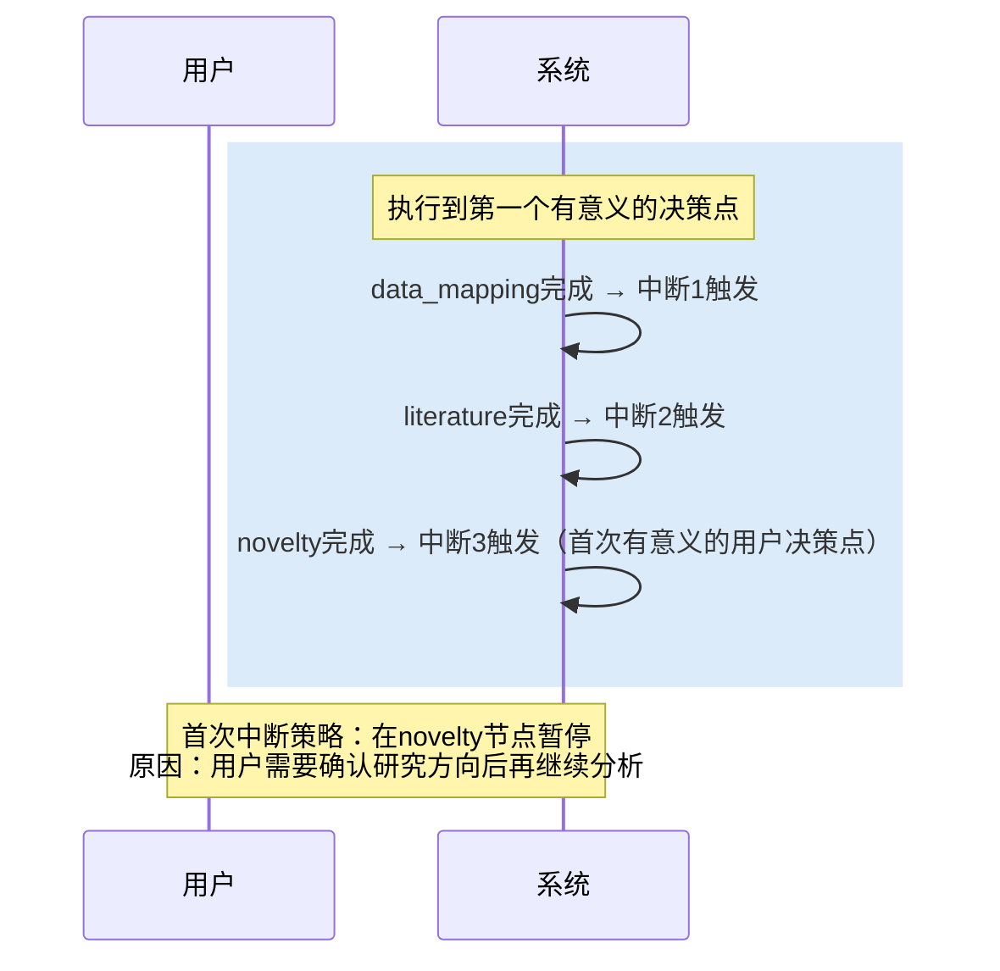
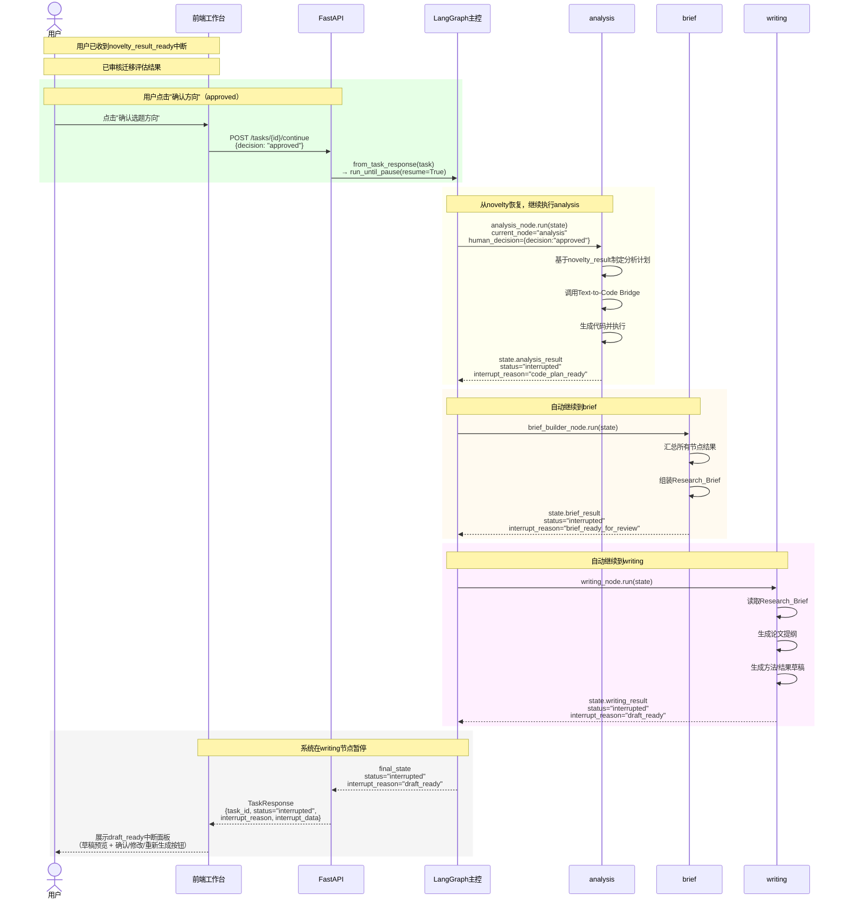
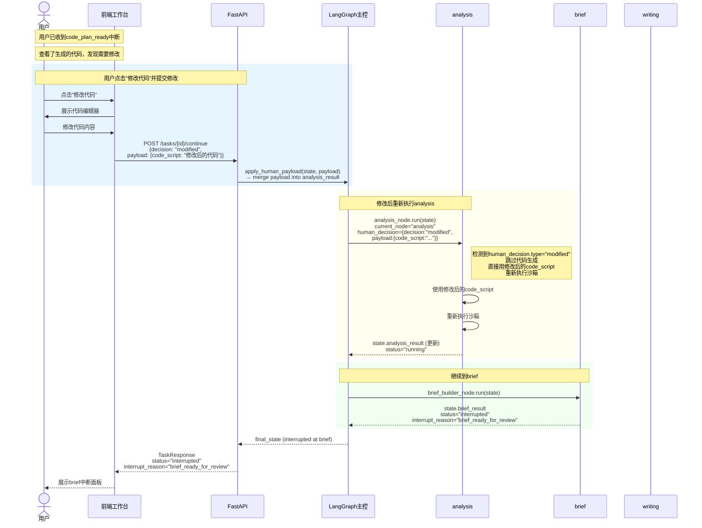
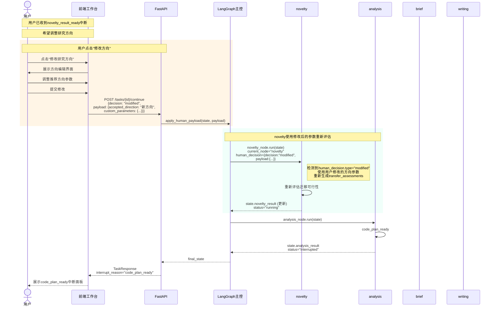
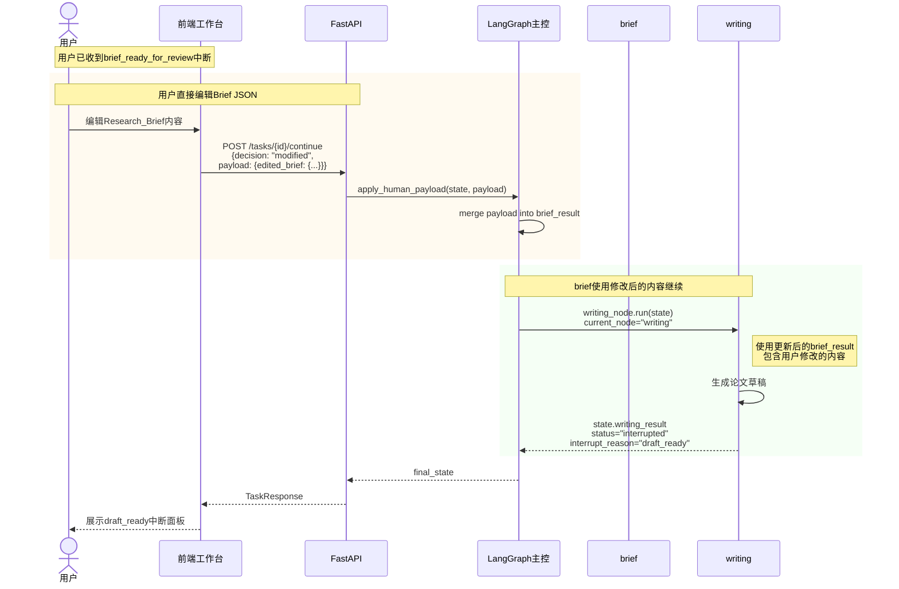
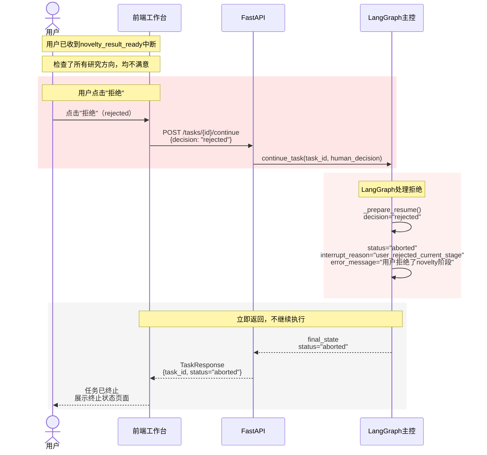
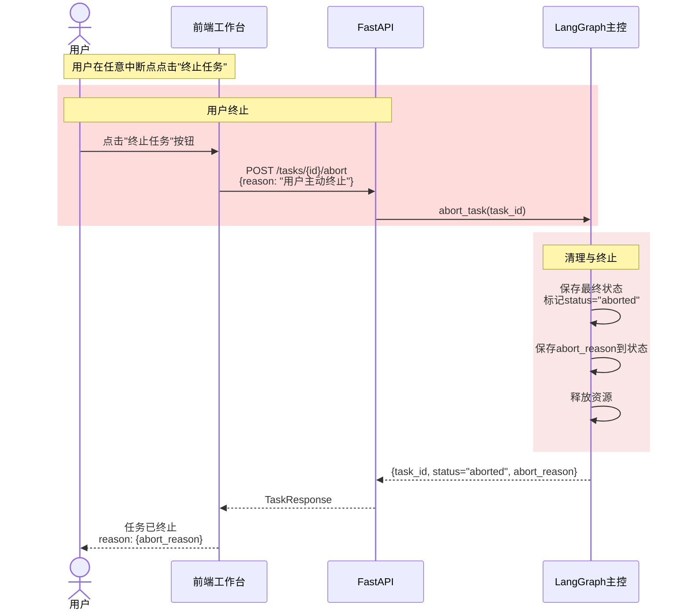
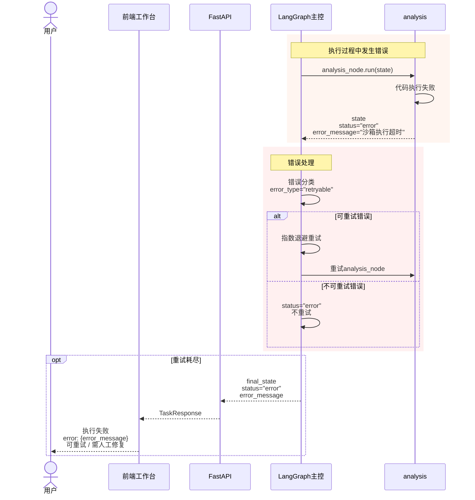

# 科研多Agent系统 - 统一时序图

> **版本**：v1.0
> **日期**：2026-04-07
> **状态**：综合 AI产品经理报告 + AI产品研发工程师报告 统一后的最终版本

---

## 一、任务创建到首次中断流程

### 1.1 完整首次中断时序（normal flow）



### 1.2 首次中断触发点详解



---

## 二、用户确认后恢复执行流程

### 2.1 用户确认后继续（approved flow）



---

## 三、用户修改决策后的恢复流程

### 3.1 用户修改代码后继续（modified flow - analysis阶段）



### 3.2 用户修改研究方向后继续（modified flow - novelty阶段）



### 3.3 用户修改Brief后继续（modified flow - brief阶段）



---

## 四、用户拒绝/中止流程

### 4.1 用户在novelty阶段拒绝（rejected flow - novelty）



### 4.2 用户在任意阶段拒绝（通用拒绝流程）



### 4.3 系统错误导致的终止（error flow）



---

## 五、中断点详细时序

### 5.1 六个中断点触发时序对照表

| 中断点 | 触发时机 | 中断后展示 | 用户可做决策 |
|--------|----------|------------|--------------|
| 中断1 | data_mapping完成 | 变量映射建议 | 确认/修改/取消上传 |
| 中断2 | literature完成 | 文献列表+方法元信息 | 确认/增删改/跳过 |
| 中断3 | novelty完成 | 迁移评估+推荐方向 | 确认/修改/拒绝 |
| 中断4 | analysis完成 | 代码+执行结果 | 确认/修改/跳过 |
| 中断5 | brief完成 | Research Brief预览 | 确认/直接修改JSON |
| 中断6 | writing完成 | 论文草稿预览 | 确认/修改/重新生成 |

### 5.2 中断数据载荷示例

```json
// 中断1: data_mapping_required
{
  "interrupt_reason": "data_mapping_required",
  "interrupt_data": {
    "file_name": "carbon_data.csv",
    "detected_columns": ["region", "year", "co2", "gdp", "fdi"],
    "detected_types": {"region": "str", "year": "int", "co2": "float", ...},
    "recommended_mapping": {
      "dependent_var": "co2",
      "independent_vars": ["gdp", "fdi"],
      "entity_column": "region",
      "time_column": "year"
    }
  }
}

// 中断3: novelty_result_ready
{
  "interrupt_reason": "novelty_result_ready",
  "interrupt_data": {
    "transfer_assessments": [
      {
        "source_method": "STIRPAT",
        "source_paper": "长江流域碳排放研究",
        "transfer_feasibility": "高",
        "required_adaptations": ["变量映射调整"]
      }
    ],
    "suggested_directions": ["基于STIRPAT的中东地区农业碳排放预测"],
    "novelty_score": 0.75
  }
}

// 中断6: draft_ready
{
  "interrupt_reason": "draft_ready",
  "interrupt_data": {
    "outline": "# 论文提纲\n1. 引言\n2. 数据与方法...",
    "abstract": "本研究旨在分析...",
    "methods": "## 数据来源\n本研究使用...",
    "results": "## 主要结果\n如图1所示...",
    "completeness_score": 0.85,
    "quality_warnings": []
  }
}
```

---

## 六、版本变更记录

| 版本 | 日期 | 变更内容 |
|------|------|----------|
| v1.0 | 2026-04-07 | 统一版本：6个中断点完整时序、modified流程细化 |
