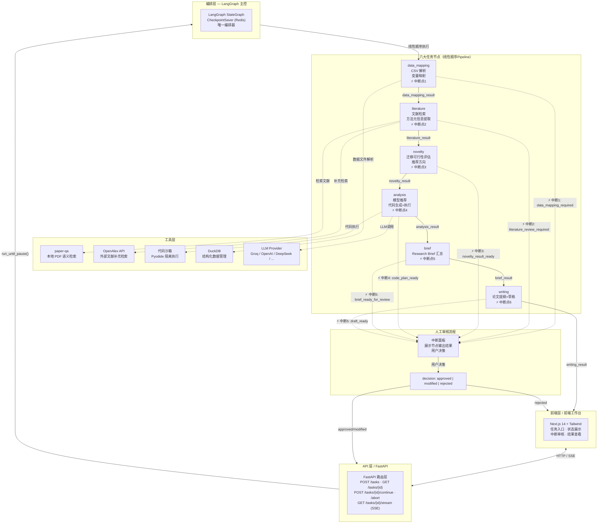
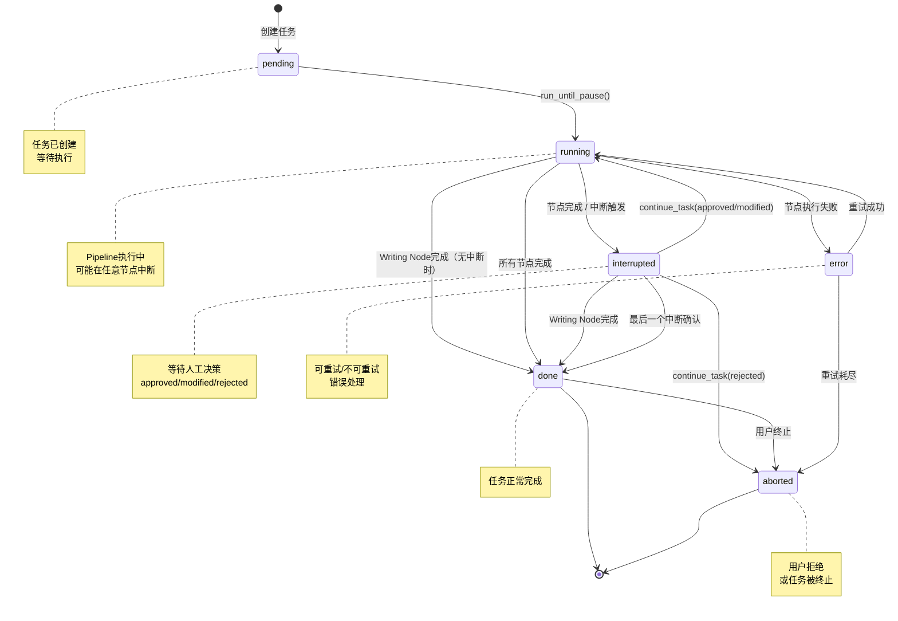
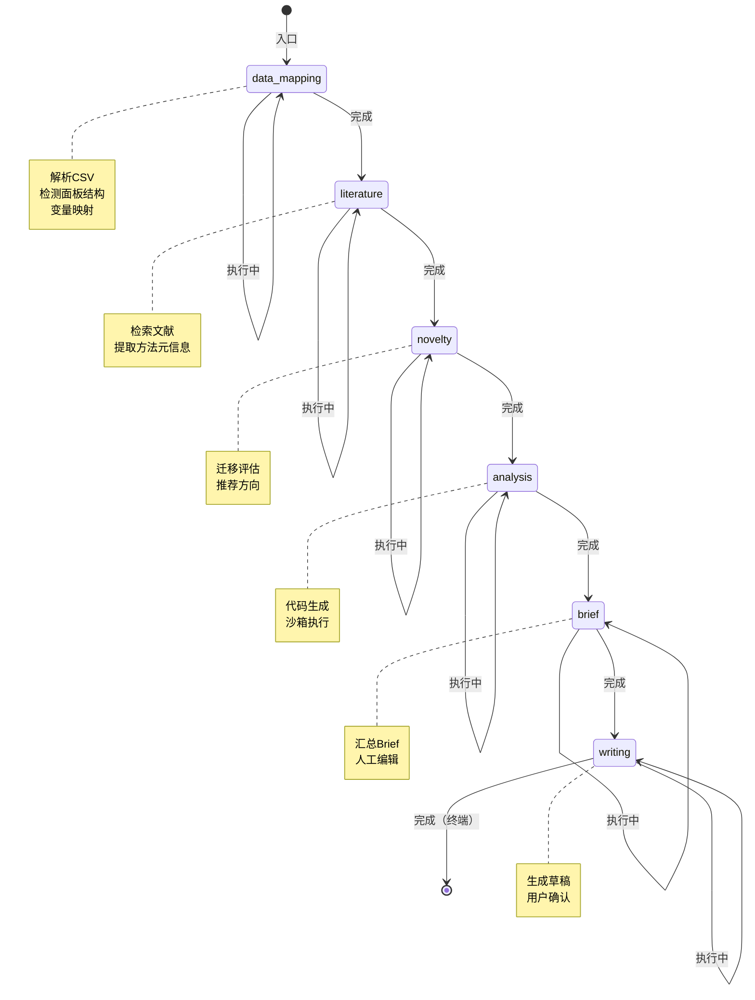
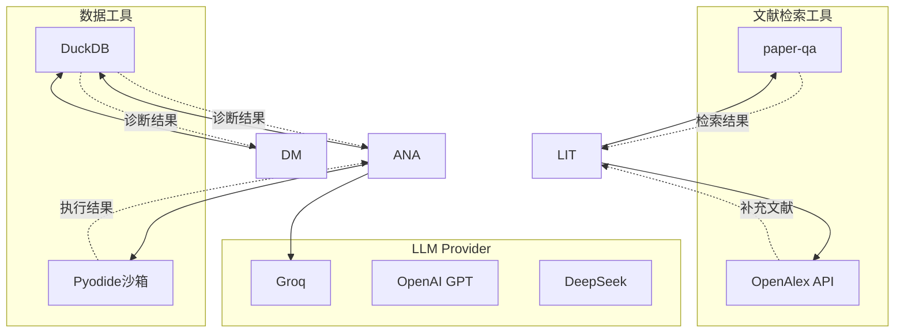

# 科研多Agent系统 - 统一架构图

> **版本**：v1.0
> **日期**：2026-04-07
> **状态**：综合 AI产品经理报告 + AI产品研发工程师报告 统一后的最终版本

---

## 一、系统整体架构图

### 1.1 完整Pipeline架构



### 1.2 节点职责定义（最终确认版）

| 节点 | 节点ID | 职责 | 输入 | 输出 | 中断点 |
|------|--------|------|------|------|--------|
| **data_mapping** | DM | CSV解析 + 变量角色映射（因变量/自变量/控制变量/面板结构检测） | 用户上传数据文件 + user_query | `data_mapping_result` | ✅ 中断1 |
| **literature** | LIT | 文献检索 + 方法元信息提取 + evidence打包 | user_query + data_mapping_result | `literature_result` | ✅ 中断2 |
| **novelty** | NOV | 迁移/组合/调整可行性评估 + 推荐方向 | literature_result + data_mapping_result | `novelty_result` | ✅ 中断3 |
| **analysis** | ANA | 模型推荐 + 证据驱动代码生成 + 沙箱执行 | novelty_result + literature_result + data_mapping_result | `analysis_result` | ✅ 中断4 |
| **brief** | BRI | 汇总完整 Research_Brief（含 transfer_context） | 前4个节点全部结果 | `brief_result` | ✅ 中断5 |
| **writing** | WRI | 生成论文提纲 + 方法/结果草稿 + 证据引用 | brief_result | `writing_result` | ✅ 中断6 |

### 1.3 数据流方向（最终确认顺序）

```
用户上传数据 + 研究问题
    │
    ▼
┌─────────────────────────────────────────────────────────────────┐
│                      六大节点线性Pipeline                        │
│                                                                  │
│  data_mapping ──▶ literature ──▶ novelty ──▶                     │
│       │              │            │                              │
│       ▼              ▼            ▼                              │
│   [中断1]        [中断2]       [中断3]                           │
│                  literature_result                              │
│                             │                                   │
│                             ▼                                   │
│                        novelty_result ──▶                        │
│                                          │                      │
│                                          ▼                      │
│                                     analysis ──▶ [中断4]        │
│                                          │                      │
│                                          ▼                      │
│                                     brief ──▶ [中断5]           │
│                                          │                      │
│                                          ▼                      │
│                                     writing ──▶ [中断6] ──▶ 完成│
│                                                                  │
└─────────────────────────────────────────────────────────────────┘
```

---

## 二、状态机流转图

### 2.1 任务状态机



### 2.2 节点状态流转



### 2.3 中断决策状态机

```mermaid
flowchart TB
    subgraph Interrupt_State["中断状态"]
        INT_TRIGGER["触发中断<br/>interrupt_reason: string<br/>interrupt_data: dict"]
        AWAIT["等待用户决策"]
        PROCESS["处理决策"]
        RESUME["恢复执行"]
    end

    subgraph Decisions["用户决策"]
        APPROVED["approved<br/>确认当前结果"]
        MODIFIED["modified<br/>修改后继续<br/>payload: 修改数据"]
        REJECTED["rejected<br/>拒绝/终止"]
    end

    INT_TRIGGER --> AWAIT
    AWAIT --> PROCESS

    PROCESS --> |"decision=approved"| APPROVED
    PROCESS --> |"decision=modified<br/>payload=data"| MODIFIED
    PROCESS --> |"decision=rejected"| REJECTED

    APPROVED --> RESUME
    MODIFIED --> RESUME
    REJECTED --> |"任务终止"| ABORT["aborted"]

    RESUME --> |"下一节点"| NEXT_NODE["下一节点继续执行"]
    RESUME --> |"resume=True"| LG["LangGraph恢复"]

    note right of INT_TRIGGER: status="interrupted"
    note right of RESUME: human_decision注入<br/>payload合并到状态
```

---

## 三、中断数据结构（统一版）

### 3.1 中断触发响应结构

```json
{
  "status": "interrupted",
  "current_node": "node_name",
  "interrupt_reason": "interrupt_id",
  "interrupt_data": {
    // 节点特定数据
  },
  "checkpoint_id": "ckpt_xxx",
  "available_decisions": ["approved", "modified", "rejected"]
}
```

### 3.2 各中断点数据结构

| 中断点 | interrupt_reason | 关键interrupt_data字段 |
|--------|------------------|------------------------|
| 数据映射 | `data_mapping_required` | detected_columns, detected_types, recommended_mapping, detected_panel_structure |
| 文献检索 | `literature_review_required` | chunks, method_metadata, quality_score, references |
| 创新性评估 | `novelty_result_ready` | transfer_assessments, suggested_directions, novelty_score |
| 代码方案 | `code_plan_ready` | code_script, execution_result, bridge_status |
| Brief确认 | `brief_ready_for_review` | brief, validation_errors, warnings |
| 草稿确认 | `draft_ready` | outline, abstract, methods, results, completeness_score |

### 3.3 继续执行请求结构

```json
{
  "decision": "approved | modified | rejected",
  "payload": {
    // decision=modified时包含修改数据
    // 其他decision时为空或null
  },
  "timestamp": "2026-04-07T10:00:00Z"
}
```

---

## 四、工具层集成

### 4.1 工具调用关系



### 4.2 工具职责矩阵

| 工具 | 使用的节点 | 职责 |
|------|------------|------|
| paper-qa | literature | 本地PDF语义检索与问答 |
| OpenAlex API | literature | 外部文献补充检索 |
| DuckDB | data_mapping, analysis | CSV/Parquet数据诊断与分析 |
| Pyodide | analysis | Python代码沙箱执行 |
| LLM Provider | novelty, analysis, writing | 推理与生成 |

---

## 五、版本变更记录

| 版本 | 日期 | 变更内容 |
|------|------|----------|
| v1.0 | 2026-04-07 | 统一版本：确认6节点、6中断点、Writing Node有中断确认 |
